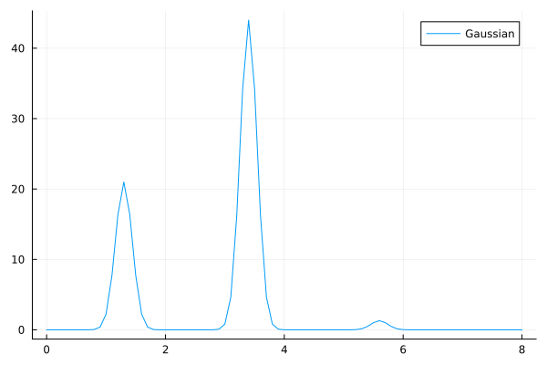

# SpectralLineShapes

[](https://github.com/chemicalfiend/SpectralLineShapes.jl/actions/workflows/CI.yml?query=branch%3Amain)

This is a tool for constructing broadened line spectra from experimental data for smoother integration!

## Usage 

```julia

using SpectralLineShapes
using Plots

ω = [1.3, 3.4, 5.6]
E = [21.0, 44.0, 1.3]

f = Gaussian(ω, E, 0.2)

x = 0.0:0.1:8.0
plot(x, f.(x), label="Gaussian")
```

